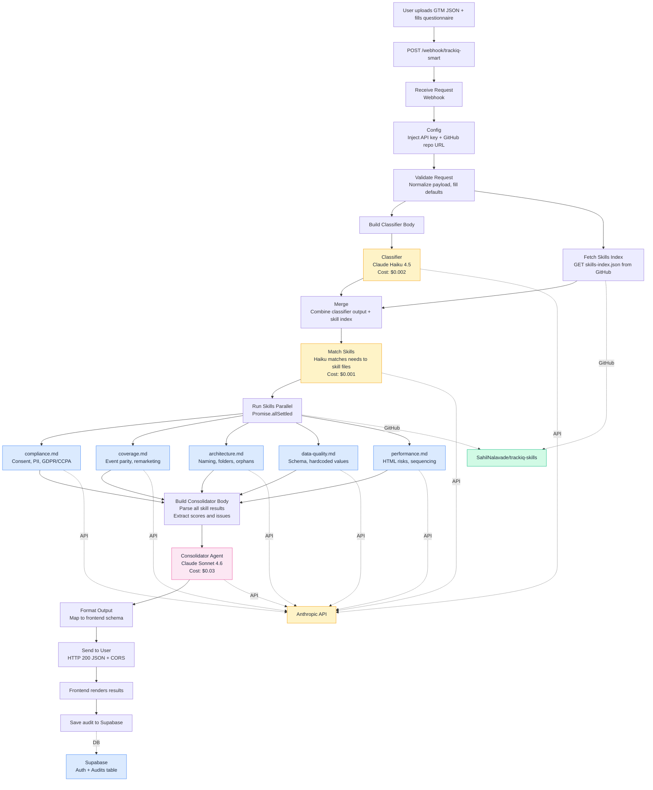

# TrackIQ - AI-Powered GTM Auditor

**Live app:** [trackiq-ten.vercel.app](https://trackiq-ten.vercel.app)

## Architecture

## How It Works

1. **User** uploads a GTM container JSON export and fills a 6-step business context questionnaire
2. **Classifier** (Haiku) describes what analysis the container needs
3. **Matcher** (Haiku) maps those needs to available skill files from this repo
4. **5 Skills** run in parallel (Haiku), each analyzing a different domain
5. **Consolidator** (Sonnet) cross-references all findings into a strategic report
6. **Frontend** renders scores, roadmap, quick wins, issues, and detailed skill breakdowns

## Skills

| File | Domain | Question It Answers |
|------|--------|-------------------|
| `compliance.md` | Consent and Privacy | Is it legal? |
| `coverage.md` | Tracking Coverage | Is tracking complete? |
| `architecture.md` | Container Organization | Is it organized? |
| `data-quality.md` | Data Layer Integrity | Is the data correct? |
| `performance.md` | Performance and Security | Is it safe and fast? |

Skills are loaded from this repo at runtime. To add a new skill, push a `.md` file and add an entry to `skills-index.json`. Zero workflow changes needed.

## Cost Per Audit

| Component | Model | Cost |
|-----------|-------|------|
| Classifier | Haiku 4.5 | $0.002 |
| Matcher | Haiku 4.5 | $0.001 |
| 5 Skills | Haiku 4.5 x5 | $0.100 |
| Consolidator | Sonnet 4.6 | $0.030 |
| **Total** | | **~$0.13** |

## Stack

- **Frontend:** Vanilla JS on Vercel
- **Backend:** n8n workflow (self-hosted)
- **AI:** Claude API (Haiku for skills, Sonnet for consolidation)
- **Auth + DB:** Supabase (email/password + Google OAuth, RLS)
- **Skills:** This GitHub repo (dynamic loading)
